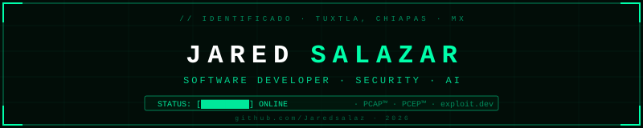

  

 

 

---

### `// SOBRE MÍ`

Soy **Jared Salazar**, desarrollador backend apasionado por crear soluciones eficientes, escalables y seguras. Mi enfoque abarca desde ingeniería de sistemas y APIs de alto rendimiento hasta inteligencia artificial y ciberseguridad ofensiva.

- ⚙️ **Backend & Sistemas:** Python · Go · SQL Server · APIs REST concurrentes
- 🤖 **Inteligencia Artificial:** LLMs, NVIDIA NIM, DeepSeek, FastAPI + PostgreSQL
- 🛡️ **Ciberseguridad & Pentesting:** Kali Linux · Metasploit · Wireshark · TryHackMe
- 🔩 **Hardware & Firmware:** ESP32 · Arduino · Raspberry Pi · Proyectos off-grid solar
- 🐳 **DevOps:** Docker · Fly.io · Linux · Git

---

### `// CERTIFICACIONES`

| Certificado | Institución | Credencial |
| :--- | :---: | :---: |
| 🐍 **PCAP™** – Certified Associate Python Programmer | Python Institute |  |
| 🐍 **PCEP™** – Certified Entry-Level Python Programmer | Python Institute |  |

---

### `// STACK TECNOLÓGICO`

#### Lenguajes

#### Frameworks & Web

#### IA & Ciencia de Datos

#### Ciberseguridad & Hacking Ético

#### Hardware & Microcontroladores

#### Bases de Datos & DevOps

---

### `// PROYECTO DESTACADO`

> **Balam** — AI-powered Barbershop SaaS · FastAPI · PostgreSQL · Flutter · NVIDIA NIM · DeepSeek · Docker · Fly.io

---

### `// ESTADÍSTICAS DE GITHUB & CONTRIBUCIONES`

  
  &nbsp;
  

    

  

---

  

